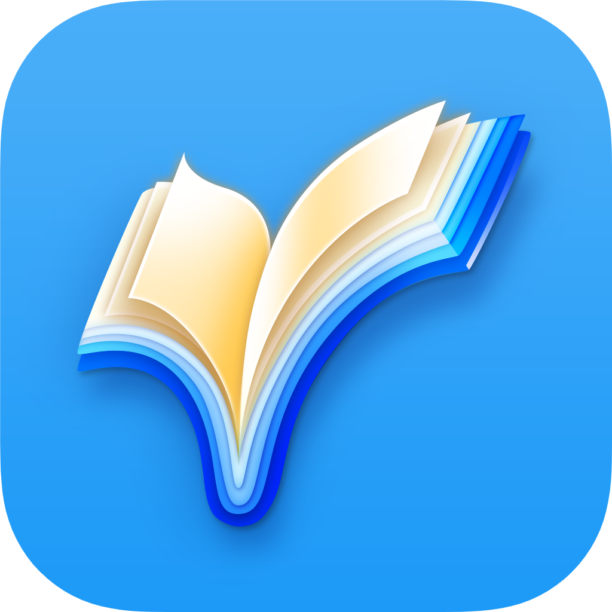

# Press Kit

## About Reading List

Reading List is a lightweight but powerful reading tracker and planner.

Reading List is designed to make it incredibly easy to plan what to read, to track your reading progress, and to record the books you have read. Books can be easily added via barcode scan or online search, but all metadata is configurable. Users can add their own notes and ratings, as well as use the powerful organisation functions to create their own named lists of books. Reading List is designed to be minimal and personal experience: there is no social network bolted on, and there is no gamification of the reading experience – just a clear and usable personal book log.

Reading List is available on iOS and iPadOS. The app is fully functional offline, and when online data synchronises seamlessly between multiple devices via iCloud.

[//]: # Reading List has been free to use since July 2017, and its passionate userbase has steadily grown since its initial release. Starting with v2.0, scheduled for release April 7th, some new powerful features will be available after a single one-time purchase to unlock Reading List Pro.

### App Details

**Apple App ID:** [1217139955](https://apps.apple.com/us/app/reading-list-book-log/id1217139955)  
**Website**: [https://readinglist.app](https://readinglist.app)  
**Twitter**: [@ReadingListApp](https://twitter.com/ReadingListApp)  

### Developer Details
**Name**: Andrew Bennet  
**Twitter**: [@AndrewBennet](https://twitter.com/AndrewBennet)  
**Email**: [feedback@readinglist.app](mailto:feedback@readinglist.app)  

## Version 2.0

Version 2.0 brings the most requested feature to Reading List: iCloud Sync. For the first time, changes made on one device will be propagated to other devices in real-time.

- **iCloud Sync**  
Keeps all devices seamlessly in sync in realtime using iCloud. The iCloud sync functionality has been written without use of the Apple provided `NSPersistedCloudKitContainer`, opting instead for a custom-written Sync Engine which means the developer is in full control of the synchronisation, and has been able to achieve efficient, reliable and high-speed synchronisation and tailored merge resolution.

- **New Look**  
Reading List has a new app icon, designed by [Michael Flarup](http://flarup.co/). The icon combines the checkmark motif typical for progress tracking with a book image, to produce a eye-catching and clever icon. The app has also had a UI refresh, with many of the screens being redesigned.

- **Reading List Pro**  
Starting in v2.0, certain new features will require a purchase of Pro membership to unlock. This is a one-time purchase, with no subscription option. All functionality prior to v2.0 will remain free, without limits.

- ••

## Loved by Users

Reading List has been exceptionally well received by its users. It is the highest-rated reading tracking app in the App Store, with a 4.8 rating from over 19,000 ratings and reviews.

## Screenshots

### App Icon

### iPhone Screenshots

### iPad Screenshots

